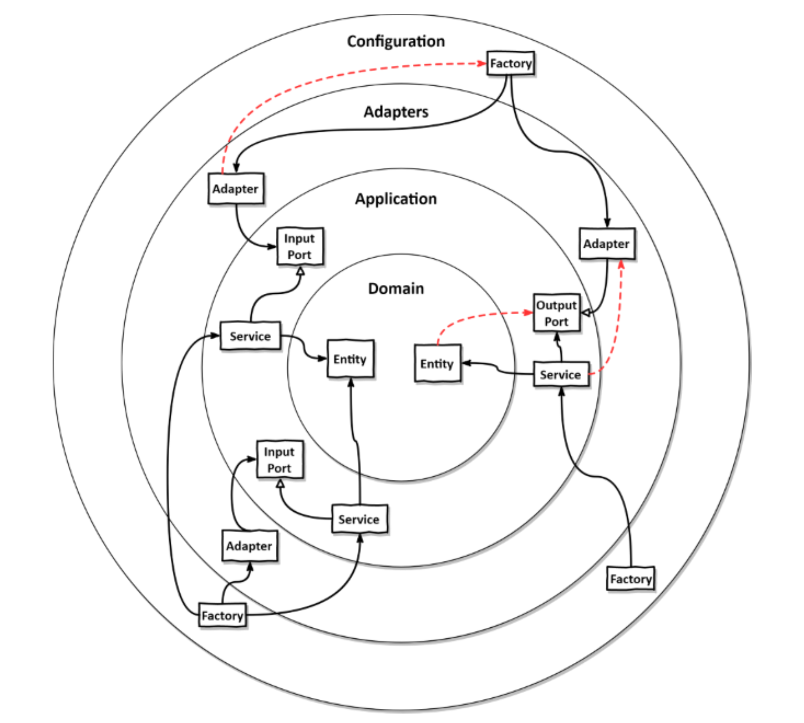
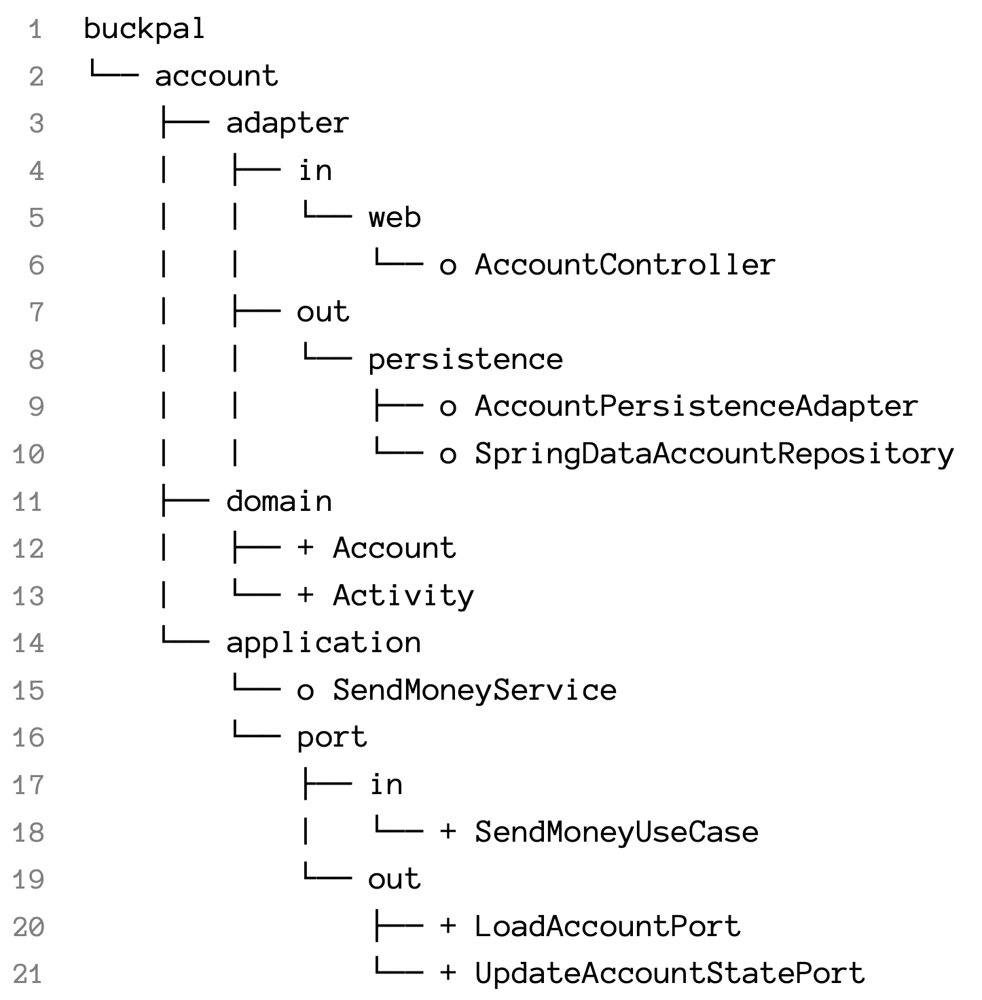
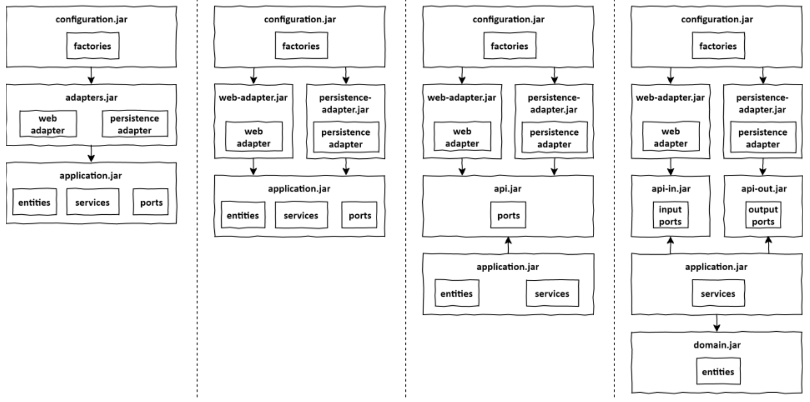

<style>
  .half {
    width: 50%;
  }
</style>

# Enforcing architecture rules

As projects grow, it becomes hard to keep erverything tidy.

We must therefore enforce the architecture rules.

## Boundaries and dependencies

Here is what our project might look like:

<div class="half">



</div>

Here, the red dotted arrows are examples of dependencies we want to prevent.

The point for us is to make sure that it is as hard as possible to cross boundaries.

## Visibility modifiers

The Java visibility modifiers are:
- `public` (accessible anywhere)
- `private` (accessible nowhere)
- `protected` (package + subclass of itself in another package)
- `package` (accessible only in the package - the default)

Our little favorite here is `package`, as it allows us to create little modules.

The only limitation is that we can't access them in sub-modules, so if we create sub-modules they must be `public`, taking the risk of somone very nasty importing it elsewhere.

In the example below, `package` visible classes are marked with a 'O' and `public` ones are marked with a '+'.

<div class="half">



</div>

As you can see, the ports and domain classes are public because we need them outside their package.

The rest can be package private because we use Spring / Spring Boot to inject them where they're needed.

## Post-compile checks

Tools like ArchUnit allows us to counter nasty developers by running dependency checks in the CI.

Here is an example:

```java
class DependencyRuleTests {
    @Test
    void domainLayerDoesNotDependOnApplicationLayer() {
        noClasses()
            .that()
            .resideInAPackage("buckpal.domain..")
            .should()
            .dependOnClassesThat()
            .resideInAnyPackage("buckpal.application..")
            .check(new ClassFileImporter()
                .importPackages("buckpal.."));
    }
}
```

With some work, we can use this API to build this kind of abstractions specific to hexagonal architecture:

```java
class DependencyRuleTests {
    @Test
    void validateRegistrationContextArchitecture() {
        HexagonalArchitecture.boundedContext("account")
            .withDomainLayer("domain")
            .withAdaptersLayer("adapter")
              .incoming("web")
              .outgoing("persistence")
              .and()
            .withApplicationLayer("application")
              .services("service")
              .incomingPorts("port.in")
              .outgoingPorts("port.out")
              .and()
            .withConfiguration("configuration").check(new ClassFileImporter()
                .importPackages("buckpal.."));
    }
}
```

## Build artifacts

We can completely prevent illegal dependencies by creating multiple artifacts with the different modules in our app.

This should be done using tools like Gradle or Maven, and may look like one of these examples:



These examples enforce different possible rules, more or less strictly, according to the mapping strategy and other choices.

## How does this help me build maintainable software?

Making sure dependency rules are respected ensure that we don't end up with a bad architecture, as long as we had good rules.
