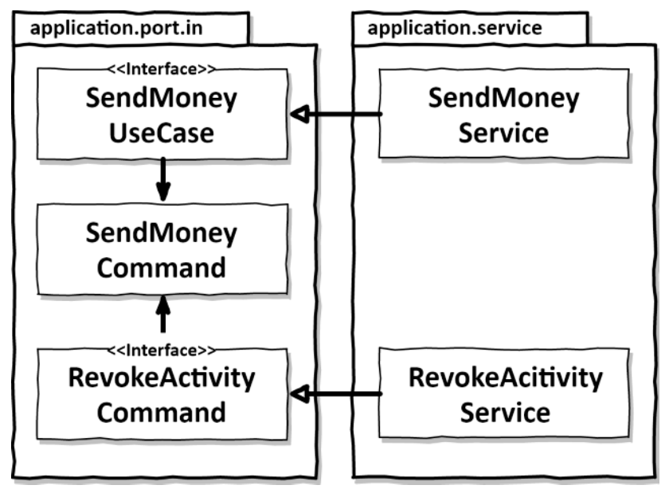
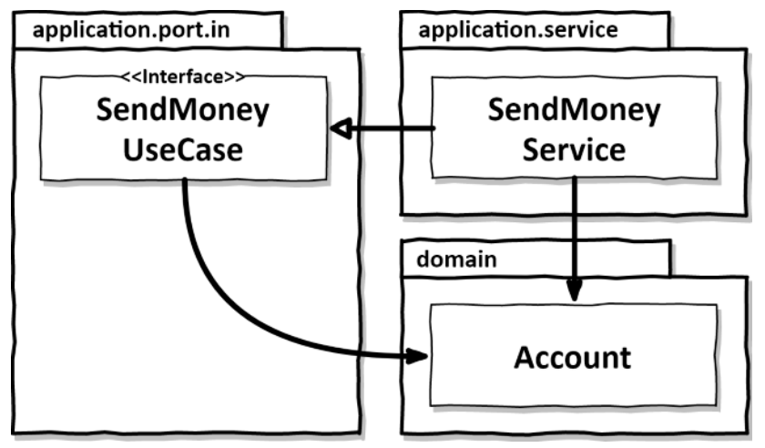
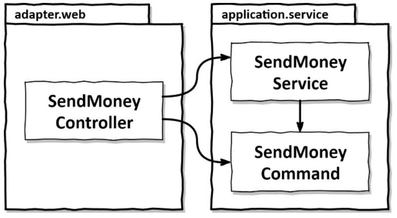
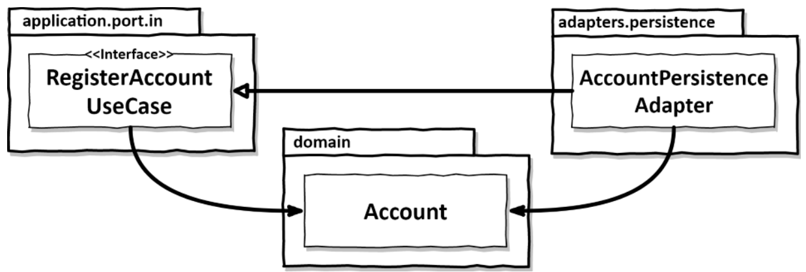

# Taking shortcuts consciously

As discussed previously, shortcuts are bad.

They have plenty of indesirable side-effects, and make our architecture look bad.

To prevent them (or use them very carefully), we must be aware of them.

## Why shortcuts are like broken windows

### The broken windows theory

Put a car in a nice neighbourhood.
No one touches it.

Break a window.
People start breaking it a bit more.

This is because feel like it's OK to break something that is already broken.

A broken windows lowers the threshold to break more windows.

### Application to code

When we take a shortcut, it lowers the threshold of other people taking this shortcut as well.

## The responsibility of starting clean

Starting clean (without any shortcuts) is very important because as soon as we introduce shortcuts, it will attract more.

We can take shortcuts for good reasons though, like for prototyping, or economical reasons, in which case shortcuts must be well documented as such, in a documentation that the team is aware of.

Architecture Decision Records are a good example of such documentation.

This chaper is a list of shortcuts.

## Sharing models between use cases

If two use cases require the same use case and won't evolve separately, then it is ok to share models between them.

That way, if when we change the model, we want the change both use cases, then this is a situation where a shared model makes sense.

## Using domain entities as input/output models

This works great for create or update use cases, where we won't need any other things than the actual domain model.

As soon as it gets more complex, we risk to change the domain entity to fit the needs of the port, which is bad.

Therefore, if we start with this shortcut, we must fix it as soon as it gets more complex.

## Skipping incomming ports

While the outgoing ports are necessary to invert the dependency, the incomming ports aren't.

Their use is mostly to define clear entrypoints to our application core.

If we're working on a small application, this strategy might work, but as the project grows, it will get harder to know which services we *can* call from an adapter, and how we can interact with the application core.

## Skipping application services

This is very tempting for CRUD use cases.

We don't want the logic to pass through ports and adapters, with a lot of boilerplate. We want to make it quick.

We therefore share a model between the persistence adapter and the input port, and the input port directly calls the persistence with this model.

The first problem is that this hides the use case.

The other issue is that we then don't have any good place to put the business logic if some day this use case gets more complex.

Again, if that happens, we will have to refactor to use application services.

## How does this help me build maintainable software?

For some cases, especially at the beginning of the program, we will have many small CRUD use cases.

Then it's fine to take a few shortctus, as long as the team agrees on replacing them when the use cases become more complex.
