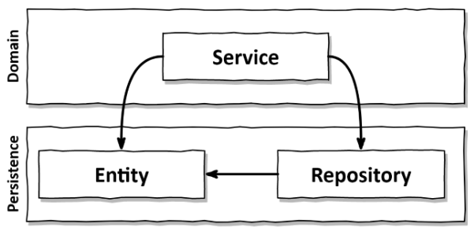
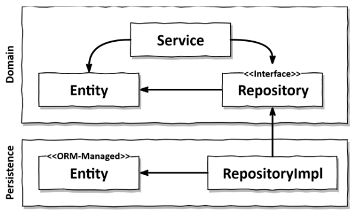
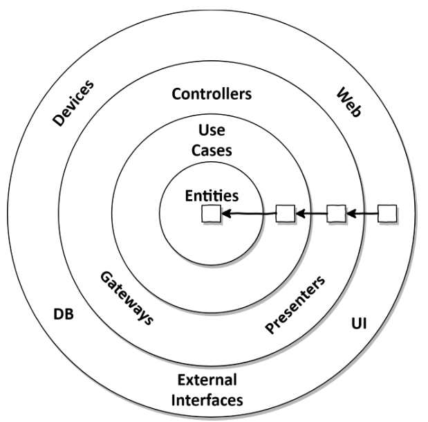
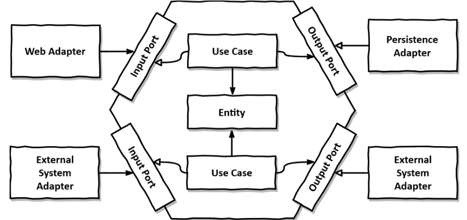

# Inverting dependencies

Now that we've said layered architecture is bad, let's give you an alternative.

This chapter discusses 2 SOLID principles and applies them to an hexagonal architecture.

## The single responsibility principle (SRP)

Common misinterpretation of the SRP : "A component should do only one thing".

A better interpretation would be : "A component should only have one reason to change".

It is often not the case because components depend on many other components, directly or indirectly.

Therefore, when one of these components change, they might have to change too.

This mistake makes the code much harder to modify as the project grows and the number of depencies increases.

## A tale about side effects

I was in a project where we had to refactor a 10 years old codebase for a client.

Though it was really hard to understand the project and improve it, we managed to make it more maintainable and easy to modify.

At the end, the client asked for a modification to be made in a very weird way.

I asked the client why he didn't want to do it the normal way, and he answered that the previous team used to introduce regressions when modifying this part of the code.

This gives an example a client who got used to bad architecture and now makes bad decisions because of it.

## The dependency inversion principle (DIP)

This principles can be summed up as so : "We can turn around (invert) the direction of any dependency within our codebase".

Remember in the layered architecture, the domain depends on the persistence layer because it needs the entities that are in the persistence layer.

Let's fix this, and make the domain layer not depend on the persistence layer.

For that, we can take the entities and put them in the domain layer, as they are part of our business logic.

We must now avoid having a circular dependency (where the persistence layer would depend on the domain layer as it depends on the entity).

To do this, we use the DIP : we create an interface for the repository in the domain layer, that will be implemented by the persistence layer.

The transformation looks like this :

This concept is key in this book.

## Clean architecture

In Robert C. Martin's book *Clean architecture*, he gives a model where the domain doesn't depend on anything, and everything depends on the domain.

It looks like this:

The entities in the middle depend on nothing.

The use cases are the possible actions on the entities, the business logic.

The domain code knows nothing about the outside, and thus will only contain the business logic, and not get disturbed by any external concerns (UI, persitence, etc.).

The main drawback is that we're going to need an implementation of the entities in each layer, as each layers needs them.

This costs time, but is nice as we often don't want the exact same entities between layers.

For example, we might have a different way to create them for the persitence because some framework forces us to respect some rules.

## Hexagonal architecture

This is a more concrete way to see the clean architecture, as Robert C. Martin's is quite abstract.

There, the business logic is in the center and depends on nothing.

On the left, the input adapters are the driving adapters : they trigger actions in the business logic.
Ex: a REST API, a website, etc.

On the right, the output adapters are the driven adapters : they get triggered by the business logic.
Ex: a persistence, an external API, etc.

These adapters use the ports of the hexagon to interact with the business logic.

It's a hexagon because it can have more than one adapter on each side (but could be any shape with more than 2 sides or each side).

## How does this help me build maintainable software?

By freeing the business logic from the other concerns, we have 2 huge upsides:
- our code is very maintainable, and a new spec doesn't require changes everywhere in the codebase.
- we can model the business code in a different way from the persistence code or the UI part. This allows us to have the perfect model for each of these.

The rest of the book will use hexagonal architecture for a web app.
