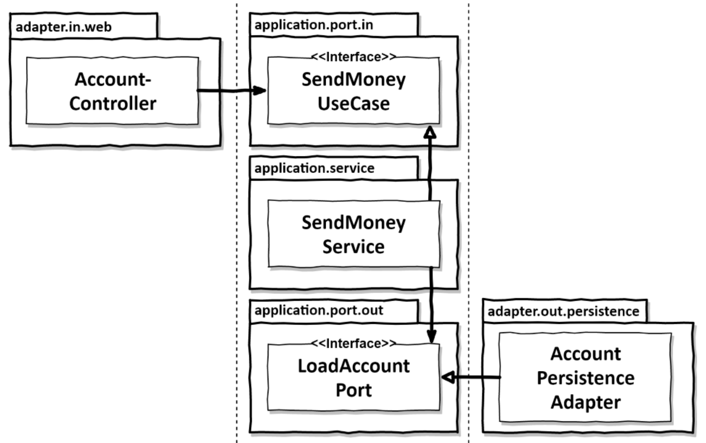

<style>
  .half {
    width: 50%;
  }

  .row {
    display: flex;
    flex-wrap: no-wrap;
    gap: 50px;
  }
</style>

# Organizing code

The first thing we do in a project is to create a nice folder structure.

The point is to make the architecture obvious just be looking at the files.

In some projects, the file structure is good, but hiding code that is badly organized.

This chapter will show you different options for structuring your application.

## Organizing by layer

```
buckpal
|──domain
|  ├── Account
|  ├── Activity
|  ├── AccountRepository
|  └── AccountService
|--persistence
|  └── AccountRepositoryImpl
└--web
   └── AccountController
```

In this example, we have already inverted the dependency between domain and persistence.

It is still not a good solution for 3 reasons:
- All the features are in the same package, and we might end up linking unrelated features.
- We can't clearly see all the use cases provided by the application.
- We can't easily see what architecture is being used, as in what the web and persistence do, and where the incoming and outgoing ports are.

## Organizing by feature

```
buckpal
|--account
|  ├── Account
|  ├── AccountController
|  ├── AccountRepository
|  ├── AccountRepositoryImpl
|  └── SendMoneyService
```

### Positive

This example separates the features completely, giving them a separate package.

This makes them independant and avoids side effects when modifying a feature.

The AccountService was also renamed to SendMoneyService to make the use case clear.

This gets closer to a "screaming architecture", as it is very easy to see excactly what functionnality the code provides.

### Negative

This structure makes the architecture even less readable than the layered approach : we can't see the adapters, nor the ports.

Also, because the AccountRepository and AccountRepositoryImpl are in the same package, we can't make sure people won't use the AccountRepositoryImpl in the SendMoneyService.

There is a better way.

## An architecturally expressive package structure

```
buckpal
└──account
   ├──adapter
   |  ├──in
   |  |  └──web
   |  |     └──AccountController
   |  ├──out
   |  |  └──persistence
   |  |     ├──AccountPersistenceAdapter
   |  |     └──SpringDataAccountRepository
   ├──domain
   |  ├──Account
   |  └──Activity
   └──application
       └──SendMoneyService
       └──port
         └──in
             └──SendMoneyUseCase
         └──out
             ├──LoadAccountPort
             └──UpdateAccountStatePort
```

### top level packages

Here, each element of an hexagonal architecture has its own package.

In the **domain**, we have our entities.

In the **application** lies the logic around these entities.

This logic uses ports, which are called (in) and implemented (out) by the adapters in the **adapter** package.

### what actually happens

Here is the way things happen here:
1. An `AccountController` (the input adapter) triggers an action.
2. The `SendMoneyService`, which implements the incoming port interface `SendMoneyUseCase`, gets called.
3. The `SendMoneyService` performs some logic using the entities in the domain.
4. The `SendMoneyService`, implementing `LoadAccountPort` and `UpdateAccountStatePort`, uses them.
5. This triggers the `AccountPersistenceAdapter` and `SpringDataAccountRepository` (the output adapters).
6. These adapters do their persistence jobs.

### Positive

This folder structure allows us to have a clear mapping between the theory (the architecture we talk about) and the code.
It allows us to easily switch from theory to code, and avoid mistakes doing so.

It also makes us think more in terms of architecture as we code, as we must put the code in places that make sense.

Most classes can be package private to their package.

This is the case for the adapters for example, as they aren't called outisde their package, except over port interfaces.

As the adapters are private, they can also easily be modified without side effects (for ecxample, is we need to change the database system).

### Negative

Some classes have to be public:
- the ports in the application package, so they can be used by the adapters outside.
- the entities in the domain package, so they can be used by the services and maybe the adapters.

It takes a lot of discipline to keep it tidy, and sometimes we will have to make exceptions to make things work.

## The role of dependency injection

<div class="half">



</div>

As you can see, dependency injection consists of giving the objects stuff they need to function, without making them dependent on the class.

To do so, an external component provides the dependency to the constructor when it instanciates the classes.

In order to avoid dependencies on the injected class, it uses an interface, and thus doesn't need to know what the injected class is : it has to respect the interace.

These interfaces are the ports.

There are 2 dependency injections happening in the graph:
- the service is injected in the input adapter via the interface of the input port `SendMoneyUseCase`
- the output adapter is injected in the service via the interface of the output port `LoadAccountPort`

That way, the input adapter can call the service, and the service can call the output adapter, all this without any dependency between each other thanks to the interfaces provided by the ports.

## How does this help me build maintainable software?

This chapter showed you the way to create a project structure that easily maps to the architectural concepts, making it easier to link the code to the high level discussions.
