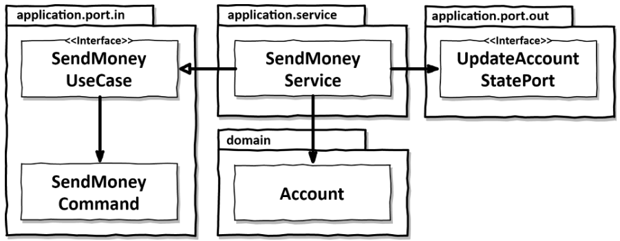

# Implementing a use case

With the project structure we created, we have a lot of options for how to structure our code, as the application, domain and persistence layers are loosely coupled.

This chapter will give one option, and show you how this looks like in actual code.

## Implementing the domain model

We want to implement the use case of sending money from one account to another.

Let's first create an Account entity in the domain.

### buckpal/domain/Account.java

```java
package buckpal.domain;
public class Account {
  private AccountId id;
  private Money baselineBalance;   // amount of money before activity window
  private ActivityWindow activityWindow;   // all transactions since last save of baseline balance
  
  // constructors and getters omitted
  
  // sums the activities and the baseline
  public Money calculateBalance() { 
    return Money.add(
      this.baselineBalance, 
      this.activityWindow.calculateBalance(this.id)
    );
  }

  // if enough money, adds a withdraw activity of the given amount to activities
  public boolean withdraw(Money money, AccountId targetAccountId) {
    if (!mayWithdraw(money)) {
      return false; 
    }
    Activity withdrawal = new Activity( this.id,
    this.id, targetAccountId, LocalDateTime.now(), money);
    this.activityWindow.addActivity(withdrawal);

    return true; 
  }

  // checks if user has enough money to withdraw the amount
  private boolean mayWithdraw(Money money) { 
    return Money.add(
    this.calculateBalance(), money.negate()).isPositive();
  }

  // adds a deposit activity of the given amount to activities
  public boolean deposit(Money money, AccountId sourceAccountId) {
    Activity deposit = new Activity(
      this.id, 
      sourceAccountId, 
      this.id, 
      LocalDateTime.now(), 
      money
    );

    this.activityWindow.addActivity(deposit);
    return true; 
  }
}
```

Now that we have the entity that respects the business rules, we can go ahead and build the use case.

## A use case in a nutshell

A use case does 4 things:
- take input (input validation isn't the responsibility of the use case)
- validate business rules (check that the action is possible)
- manipulate model state (modify the domain entities, and use output ports most often to persist these changes)
- return output (send infos back to the input adapter that called it)

To create the "send money" use case, we will create its own service class, as each use case must have its own class.

The structure of this class would look like this:

```java
package buckpal.application.service;
@RequiredArgsConstructor
@Transactional
public class SendMoneyService implements SendMoneyUseCase { // implements the input port interface to be called by the input adapters
    // contains the output ports, so that in can get injected with the output adapters
    private final LoadAccountPort loadAccountPort;
    private final UpdateAccountStatePort updateAccountStatePort;

    private final AccountLock accountLock;

    @Override
    public boolean sendMoney(SendMoneyCommand command) {  // This input command will be responsible for the input validation
        // TODO: validate business rules
        // TODO: manipulate model state
        // TODO: return output
    }
}
```



## Validating input

As we said, the use case does not have to validate the input.

But we won't validate the input in each input adapter either because they might make errors, and it will result in duplicated code.

We will therefore validate the input using the input class, in our example `SendMoneyCommand`.

This validation will happen in the constructor, like so:

```java
package buckpal.application.port.in; // validation is part of the input port (inside the hexagon)

@Getter
public class SendMoneyCommand {
  // input model, final (immutable) so no possible changes after validation
  private final AccountId sourceAccountId;
  private final AccountId targetAccountId;
  private final Money money;

  public SendMoneyCommand(AccountId sourceAccountId, AccountId targetAccountId, Money money) {
    this.sourceAccountId = sourceAccountId;
    this.targetAccountId = targetAccountId;
    this.money = money;

    // input validation (will throw if any condition is not respected)
    requireNonNull(sourceAccountId);
    requireNonNull(targetAccountId);
    requireNonNull(money);
    requireGreaterThan(money, 0);
  }
}
```

In Java, we can even make this more concise:

```java
package buckpal.application.port.in;

@Getter
public class SendMoneyCommand extends SelfValidating<SendMoneyCommand> {
    @NotNull
    private final AccountId sourceAccountId;
    @NotNull
    private final AccountId targetAccountId;
    @NotNull
    private final Money money;
    public SendMoneyCommand(AccountId sourceAccountId, AccountId targetAccountId, Money money) {
        this.sourceAccountId = sourceAccountId;
        this.targetAccountId = targetAccountId;
        this.money = money;
        requireGreaterThan(money, 0);
        this.validateSelf();
    }
}
```

For some complex validation, this SelfValidating class might not be sufficient.

We will then have to implement it ourselves, doing something that looks like this:

```java
package shared;
public abstract class SelfValidating < T > {
    private Validator validator;
    public SelfValidating() {
        ValidatorFactory factory = Validation.buildDefaultValidatorFactory();
        validator = factory.getValidator();
    }
    protected void validateSelf() {
        Set < ConstraintViolation < T >> violations = validator.validate((T) this);
        if (!violations.isEmpty()) {
            throw new ConstraintViolationException(violations);
        }
    }
}
```

The input class we created will now protect our use case against bad input, without polluting the use case code with validation code.

## The power of constructors

You might be tempted to use the builder pattern for these big constructors.

The problem with this is that you might add a new field in the builder but not in the code that calls the builder.

This won't trigger any compilation error.

That's why constructors are better : if you forget a field, it doesn't compile.

## Different input models for different use cases

We might also want to use the same input model for different use cases.

This is not a good idea for a simple reason : this links the different use cases together.

For example, for 2 use cases that use the same object, some day you might want to pass one more parameter to one of them.

You will then need a default value for the use case that doesn't use it, and that will make validation much less clear.

In addition, it might cause side effects when modifying a use case, which we do **not** want.

## Validating business rules

### Input rules vs. business rules
Business rules, in opposition to input rules, are part of the use case.

The distinction between these two can be made by answering the question "Does this validation need the current model state to be made?"

If the answer is "no", then it is an input validation, and should be done **declaratively** outside the use case.
Example: "the transfer amount must be greater than zero"

If the answer is "yes", then it is a business rule validation, and should be done inside the use case.
Example: "the source account must not be overdrawn"

There are 2 ways to implement a business rule.

### Business rule validation in the domain entity

This is the best way to do it.

Example:

```java
package buckpal.domain;
public class Account {
    // ...
    public boolean withdraw(Money money, AccountId targetAccountId) {
        if (!mayWithdraw(money)) {
            return false;
        }
        // ...
    }
}
```

It is better to place it here because that way it is next to the business logic that needs that rule to be respected.

It is therefore easier to reason about.

### Business rule validation in the use case

Sometimes, you can't do the validation in the business entity.

You then have to place the validation within the use case before using the business entities.

Example:

```java
package buckpal.application.service;
@RequiredArgsConstructor
@Transactional
public class SendMoneyService implements SendMoneyUseCase {
    // ...
    @Override
    public boolean sendMoney(SendMoneyCommand command) {
        requireAccountExists(command.getSourceAccountId());
        requireAccountExists(command.getTargetAccountId());...
    }
}
```

## Rich vs. anemic domain model

Our architecture style allows us to choose between these and even others.

Here is what it would look like for these two.

### Rich domain model

That's what we have done in the previous examples.

Almost all the business rule validation and logic are in the model, the business rules are checked there, the modifications are done in there.

The use cases are then just an entry point to the domain model.

There is almost no logic left in the use cases.

This follows the DDD philosophy.

### Anemic domain model

In this case, the domain entities contain only their state, getters and setters.

The business rule validation and logic are in the use cases.

This allows to have all code for one use case in only one place and not mixed with the rest.

It makes the domain model pretty much useless, as it will only reflect the database entities.

## Different output models for different use cases

Same as for the input models, we must not use the same output model for different use cases.

This will make them coupled, promote side effects, and require complex changes when changing only one of them.

It is also better the return as little information as possible.
When in doubt, take the smallest output model possible.

You must also resist the temptation to use domain entities as output models, as we don't want these to depend on this.
Chapter 11 discusses the way to tak this shortcut consciously.

## What about read-only use cases?

Sometimes, we might have the need to just get an information from the database.
Let's say "view account balance".

It is awkward to talk about a use case for this, and we might want to separate these non-modifying queries from the modifying commands.

It is possible to do so, by creating a query service.

It works exactly like a use case does. It has its own input port, and uses an output port to get the information.

Here is what it would look like :

```java
package buckpal.application.service;
@RequiredArgsConstructor
class GetAccountBalanceService implements GetAccountBalanceQuery {
    private final LoadAccountPort loadAccountPort;
    @Override
    public Money getAccountBalance(AccountId accountId) {
        return loadAccountPort.loadAccount(accountId, LocalDateTime.now())
            .calculateBalance();
    }
}
```

The only difference is that the input port is called a query, and not a use case.

Here again, Chapter 11 will discuss a possible shortcut for this.

## How does this help me build maintainable software?

This complete separation of input and output models, and of the logic of each use cases has great advantages.

As everything is somewhat independant, the code much more maintainable.

This also allows multiple developers to work at the same time without much conflicts.

In the end, the time spent respecting these rules is worth it.
