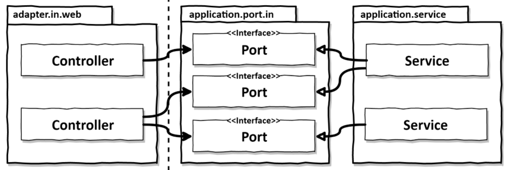
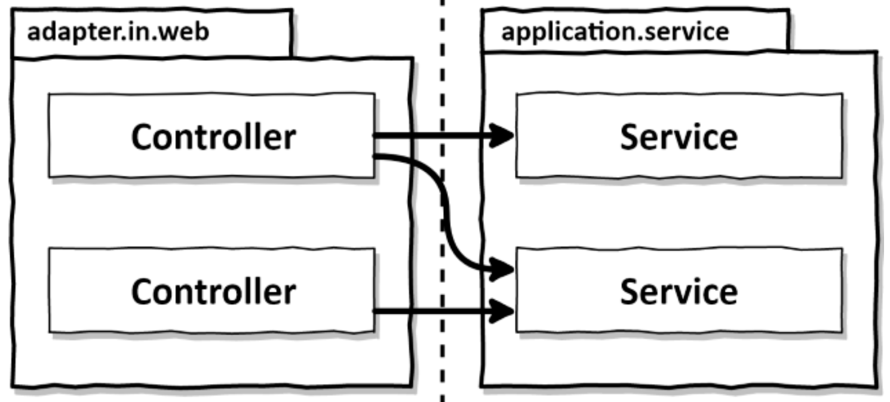
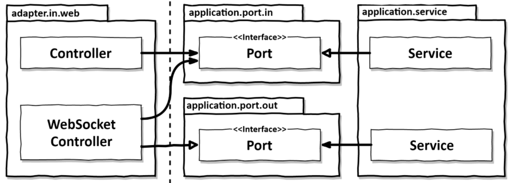

<style>
  .half {
    width: 50%;
  }
</style>

# Implementing a web interface

In most applications, there is a web entrypoint (API/website).

Let's see how we can build one following the hexagonal architecture.

## Dependenxy inversion

Here is what the interactions between the input adapters and the application services look like:

<div class="half">



</div>

The web adapter is called an "incomming" or "driving" adapter.

The outside world calls it, and it calls the application core, telling it to do something.

It does so by calling an incomming port, which is implemented by a service.

This is dependency inversion, as the input adapter could call the services directly, as showed below:

<div class="half">



</div>

But we won't do that, because having ports gives us a clear definitions of how and where the outisde world interacts with our application core.

This is very useful for maintaining and understanding the project.

Again, Chapter 11 discusses the possibility to take this shortcut.

If we need a two way communication between the web adapter and the application core, we can also make the web adapter both a "driving" (in) and "driven" (out) adapter, like in the graph below:

<div class="half">



</div>

In this chapter, we will focus on a web adapter as an incomming adapter only.

## Responsibilities of a web adapter

Here is what the web adapter does, with examples for a REST API adapter:

0. Listen for requests from the outside (listen on a specific URL, for example)
1. Map request to Java objects (HTTP object to Java object)
2. Perform authorization checks (make sure the user is authentified and can access this route)
3. Validate input (checking that the HTTP object can be transformed into the input model of the use case)
4. Map input to the input model of the use case (creating an instance of the input model class)
5. Call the use case (passing the instance we just created)
6. Map output of the use case back to HTTP (Java object to HTTP object)
7. Return HTTP response (send HTTP response back to caller)

This responsibility on the incomming adapter allows the application core to not know we use HTTP.

It will therefore be easy to switch to other adapters later on (GraphQL, etc.).

The distinction between what must be done in the application core and in the web adapter comes naturally if we start by creating the application core, implementing the use cases first.

## Slicing controllers

It is possible (and recommended) to build controllers composed of multiple classes.

### Split by entity

The minimum split would be to split by entity, for example having an `AccountController` class with all the routes that relate to accounts.

Here is what it would look like:

```java
package buckpal.adapter.web;
 @RestController
 @RequiredArgsConstructor
 class AccountController {
    private final GetAccountBalanceQuery getAccountBalanceQuery;
    private final ListAccountsQuery listAccountsQuery;
    private final LoadAccountQuery loadAccountQuery;

    private final SendMoneyUseCase sendMoneyUseCase;
    private final CreateAccountUseCase createAccountUseCase;

    @GetMapping("/accounts")
    List < AccountResource > listAccounts() {}
    @GetMapping("/accounts/id")
    AccountResource getAccount(@PathVariable("accountId") Long accountId) {
        ...
    }
    @GetMapping("/accounts/{id}/balance")
    long getAccountBalance(@PathVariable("accountId") Long accountId) {
        ...
    }
    @PostMapping("/accounts")
    AccountResource createAccount(@RequestBody AccountResource account) {
        ...
    }
    @PostMapping("/accounts/send/{sourceAccountId}/{targetAccountId}/{amount}") void sendMoney(
        @PathVariable("sourceAccountId") Long sourceAccountId,
        @PathVariable("targetAccountId") Long targetAccountId,
        @PathVariable("amount") Long amount) {
        ...
    }
}
```

This approach does have downsides though, like the fact that we might end up with huge classes, which grows hard to read and maintain, and conflicts when developers work on different routes of this controller.

This class will also have many tests in the same place, which again won't help us.

Finally, with everything in one place, we might get tempted to reuse data structures, which as always is a bad idea because it couples things that shouldn't be.

### Split by operation

This split consists of creating one class - possibly in its own package - per operation.

Here is what one operation would look like:

```java
package buckpal.adapter.web;
@RestController @RequiredArgsConstructor
public class SendMoneyController {
    private final SendMoneyUseCase sendMoneyUseCase;
    @PostMapping(path = "/accounts/sendMoney/{sourceAccountId}/{targetAccountId}/{amount}")
    void sendMoney(
        @PathVariable("sourceAccountId") Long sourceAccountId, @PathVariable("targetAccountId") Long targetAccountId, @PathVariable("amount") Long amount) {
        SendMoneyCommand command = new SendMoneyCommand(new AccountId(sourceAccountId), new AccountId(targetAccountId), Money.of(amount));
        sendMoneyUseCase.sendMoney(command);
    }
}
```

This basically counters all the downsides of the previous approach by splitting everything.

It is important to give a good naming to these classes, as semantic as possible.
For example, `CreateAccountController` might be named `registerAccountController` for more clarity.

## How does this help me build maintainable software?

When building this adapter, we create classes that only do HTTP work and conversion, and not any domain logic.

This, in addition to a good splitting, will make the code easier to test, and read, and the time lost setting this up will pay off in the end.

