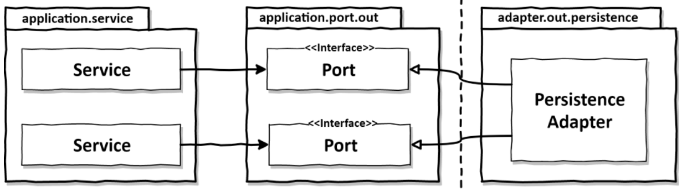
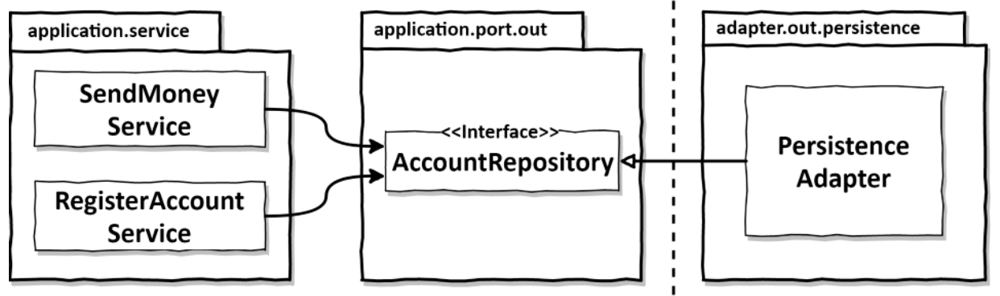
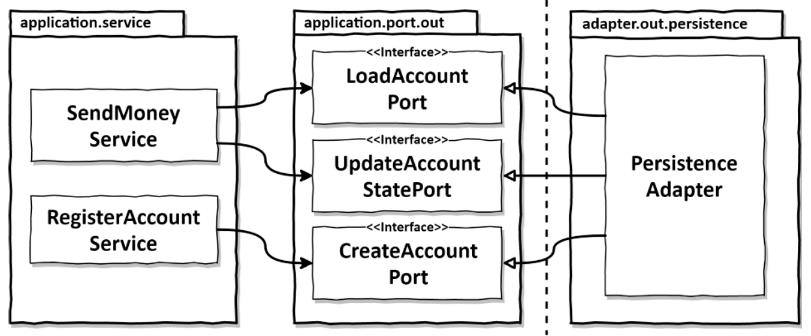
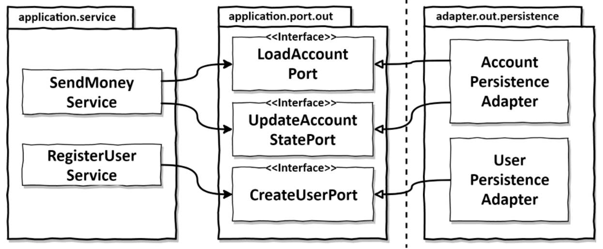
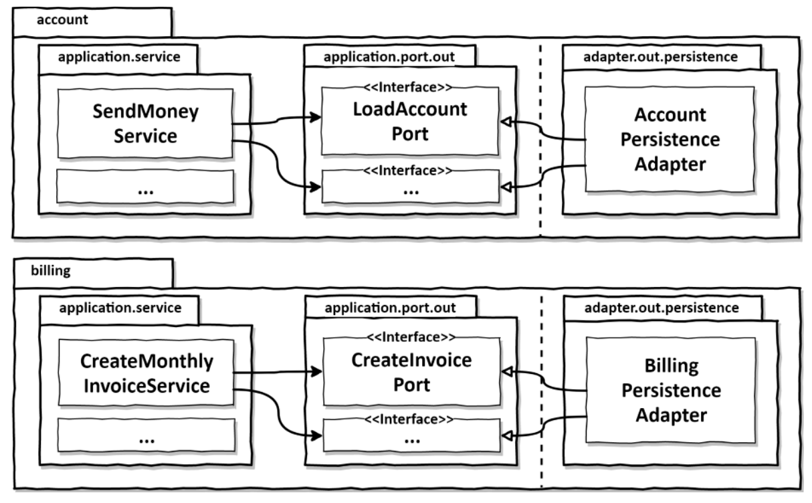

<style>
  .half {
    width: 50%;
  }
</style>

# Implementing a persistence adapter

One of the downsides of layered architecture we talked about is that it promotes database-driven design.

Let's see how to avoid this problem, and make sure our business logic does not depend on our database schema or persistence.

## Dependency inversion

The point here is to consider the persistence not as a **layer**, but as an **adapter**, a tool used by the application core to persist data.

We don't want the application to depend on the persistence, so as always we'll create an interface (a port) that will be implemented by the "outgoing" or "driven" adapters.

These adapters will be called by the service, not the other way around.

Here is what it will look like:

<div class="half">



</div>

Of course in the end the application core depends on the persistence adapter, because the program will break if the persistence is not done properly.

But changes in the persistence code won't necessarily be reflected on the business logic, as long as the port, the contract between the two, is respected.

## Responsibilities of a persistence adapter

Here are the missions of the persistence adapter:
1. Take input as a domain entity or another input model (the validation happens in the application core, to avoid changes in persistence to be reflected on the business logic)
2. Map input into database format (example: Account to Java Persistence API Account entity)
3. Send input to the database (send query, get response)
4. Map database output into application format (example: JPA Account entity to Account domain entity)
5. Return output (send back to the business logic)

## Slicing port interfaces

### Slicing by entity

As before, we have the option to put everything concerning an entity in a common interface.

This is a common practice, and the interface is then called a "Repository".

Here is what this looks like:

<div class="half">



</div>

This is a bad practice because then everything that uses one of the methods of the repository depends on the complete repository.

It becomes hard to know chich ones are actually used, and mocking quickly becomes a mess.

> Depending on something that carries baggage that you don’t need can cause you troubles that you didn’t expect.

### Interface segregation principle

This principle is pretty self explanatory, here is what it looks like for us:

<div class="half">



</div>

This allows us to just use the method we really need, and express it clearly.

This approach doesn't prevent having a couple methods in the same interface when they are tightly linked.

## Slicing persistence adapters

Obviously, we don't want all our persistence ports to be implemented by one single class.

Actually, as long as all ports are implemented, we don't care which classes implement which port(s).

The best split for the persistence adapters is to split by entity.

In DDD, these splits would be called "aggregate".

Here is what it looks like:

<div class="half">



</div>


### Usage with bounded contexts

It's also a nice split for supporting bounded contexts.

A bounded context is a clearly defined part of our app that has certain rules.

Therefore, let's say we have two contexts: "billing" and "account".

It would look something like this:



Billing can't access the adapters for account, and vice versa.

If it needs to access it, it has to use the incomming port of account, which will call its persistence adapter.

## Example with spring data JPA

This section will focus on building the `AccountPersistenceAdapter`.

It interacts with the DB to save and load accounts.

### The domain entity we work with

Here is the skeleton of the `Account` domain entity:

```java
package buckpal.domain;
@AllArgsConstructor(access = AccessLevel.PRIVATE)
public class Account {
  @Getter private final AccountId id;
  @Getter private final ActivityWindow activityWindow;
  private final Money baselineBalance;
  public static Account withoutId(Money baselineBalance,
    ActivityWindow activityWindow) {
    return new Account(null, baselineBalance, activityWindow);
  }
  public static Account withId(AccountId accountId,
    Money baselineBalance,
    ActivityWindow activityWindow) {
    return new Account(accountId, baselineBalance, activityWindow);
  }
  public Money calculateBalance() { // ...
  }
  public boolean withdraw(Money money, AccountId targetAccountId) { // ...
  }
  public boolean deposit(Money money, AccountId sourceAccountId) { // ...
  }
}
```

This class is very rich, and does all the validation, be it at creation time, or when calling modifying methods, in order to ensure that nothing in it could corrupt our data.

### Creating the JPA entities

```java
package buckpal.adapter.persistence;

@Entity
@Table(name = "account")
@Data
@AllArgsConstructor
@NoArgsConstructor
class AccountJpaEntity {
  @Id
  @GeneratedValue
  private Long id;

}
```

```java
package buckpal.adapter.persistence;
@Entity
@Table(name = "activity")
@Data
@AllArgsConstructor
@NoArgsConstructor
class ActivityJpaEntity {
  @Id
  @GeneratedValue
  private Long id;
  @Column private LocalDateTime timestamp;
  @Column private Long ownerAccountId;
  @Column private Long sourceAccountId;
  @Column private Long targetAccountId;
  @Column private Long amount;
}
```

These entities are far from perfect, and we will definitely want to add things in the future.

For example, a relationship between an account and its activities, or more fields in the account.

### CRUD with JPA

JPA allows us to have a basic CRUD for entities defined like we did.

Here is how:

```java
interface AccountRepository extends JpaRepository<AccountJpaEntity, Long> {

}
```

```java
interface ActivityRepository extends JpaRepository <ActivityJpaEntity, Long> {
  @Query("select a from ActivityJpaEntity a " +
    "where a.ownerAccountId = :ownerAccountId " +
    "and a.timestamp >= :since")
  List <ActivityJpaEntity> findByOwnerSince(
    @Param("ownerAccountId") Long ownerAccountId,
    @Param("since") LocalDateTime since);

  @Query("select sum(a.amount) from ActivityJpaEntity a " +
    "where a.targetAccountId = :accountId " +
    "and a.ownerAccountId = :accountId " +
    "and a.timestamp < :until")
  Long getDepositBalanceUntil(
    @Param("accountId") Long accountId,
    @Param("until") LocalDateTime until);

  @Query("select sum(a.amount) from ActivityJpaEntity a " +
    "where a.sourceAccountId = :accountId " +
    "and a.ownerAccountId = :accountId " +
    "and a.timestamp < :until")
  Long getWithdrawalBalanceUntil(
    @Param("accountId") Long accountId,
    @Param("until") LocalDateTime until);
}
```

Now that we have the JPA entities and repository, we can use them to build the adapter.

### Creating the actual persistence adapter

Here is the code for the persistence adapter:

```java
@RequiredArgsConstructor
@Component
class AccountPersistenceAdapter implements // implements the outgoing ports
LoadAccountPort,
UpdateAccountStatePort {
    private final AccountRepository accountRepository;
    private final ActivityRepository activityRepository;
    private final AccountMapper accountMapper;
    @Override
    public Account loadAccount(AccountId accountId,
        LocalDateTime baselineDate) {
        AccountJpaEntity account =
            accountRepository.findById(accountId.getValue())
            .orElseThrow(EntityNotFoundException::new);
        List <ActivityJpaEntity> activities =
            activityRepository.findByOwnerSince(
                accountId.getValue(),
                baselineDate);
        Long withdrawalBalance = orZero(activityRepository
            .getWithdrawalBalanceUntil(
                accountId.getValue(),
                baselineDate));
        Long depositBalance = orZero(activityRepository
            .getDepositBalanceUntil(
                accountId.getValue(),
                baselineDate));
        return accountMapper.mapToDomainEntity(account,
            activities,
            withdrawalBalance,
            depositBalance);
    }

    private Long orZero(Long value) {
        return value == null ? 0L : value;
    }

    @Override
    public void updateActivities(Account account) {
        for (Activity activity: account.getActivityWindow().getActivities()) {
            if (activity.getId() == null) {
                activityRepository.save(accountMapper.mapToJpaEntity(activity));
            }
        }
    }
}
```

In the code, you can see that we first map the domain entity into a jpa entity, and then the jpa entity to a domain entity.

You might wonder why we need this mapping, and why not just give jpa annotations to the domain entity.

This is valid, but when we have a rich domain model it gets hard:
- the JPA forces you to have a no-args constructor
- you might want to do things differenty in the db and in the domain (ex: have a `@OneToMany` in the jpa, but not store this relationship the same way in the domain, as you do'nt need all the information all the time).

These type of contraints promote database-driven design, and force you to adapt your business logic to your persistence, which is a bad practice as discusses previously.

## What about database transactions?

Database transactions is a way to link a group of commands (SQL queries for example), and rollback everything if one of them fails.

We can simply implement this with Spring by adding the `@Transactional` annotation on top of the use cases.

If we want to keep it out of the business logic, because it is persistence logic, we can use aspect-oriented programming.

## How does this help me build maintainable software?

The ability to use the persistence as a plug-in to be used by our business logic without dependency makes writing business logic much easier, and cleaner, especially with a rich domain model.

Slicing these adapters makes their moification and maintenance much easier, as long as all the outgoing ports are fulfilled we can modify everything as we want.


