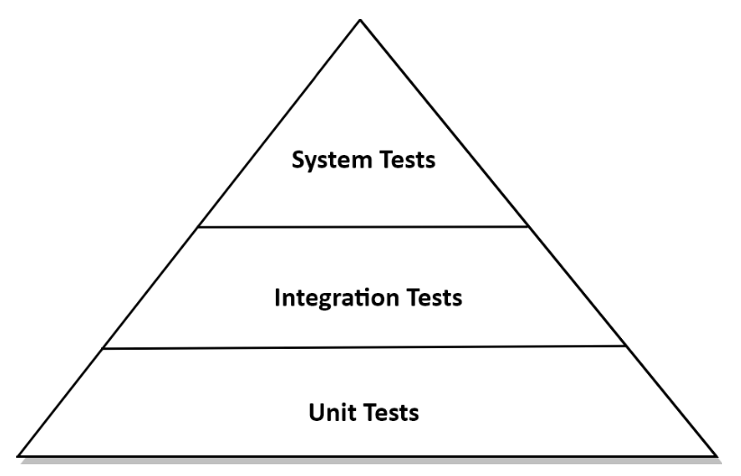

<style>
  .half {
    width: 50%;
  }
</style>

# Testing architecture elements

## The test pyramid

### Overview

Here is what the test pyramid looks like:

<div class="half">



</div>

Here is a quick summary of what it means:

You must create lots of unit tests, less integration tests and some system tests.

This is because we want a lot of cheap tests but not too many expensive tests.

### Unit tests

This is the smallest type of test.

It usually tests just one class, mocking all of its dependencies, and using its API.

### Integration tests

This is an intermediate test, in which you don't mock everything, but instead make different parts work together.

### System tests

These tests use the entire application, and tests a complete use case for example.

### End-to-end tests

These tests include the full application, including the UI, but we won't consider them here.

## Testing a domain entity with unit tests

```java
class AccountTest {
    @Test
    void withdrawalSucceeds() {
        AccountId accountId = new AccountId(1L);
        Account account = defaultAccount()
            .withAccountId(accountId).withBaselineBalance(Money.of(555L)).withActivityWindow(new ActivityWindow(
                defaultActivity()
                .withTargetAccount(accountId)
                .withMoney(Money.of(999L)).build(),
                defaultActivity()
                .withTargetAccount(accountId)
                .withMoney(Money.of(1L)).build()))
            .build();
        boolean success = account.withdraw(Money.of(555L), new AccountId(99L));
        assertThat(success).isTrue();
        assertThat(account.getActivityWindow().getActivities()).hasSize(3);
        assertThat(account.calculateBalance()).isEqualTo(Money.of(1000L));
    }
}
```

This is a rather simple test, creating an account, performing a couple actions on it and testing the result.

As domain entites have few dependencies, they're fadt and easy to test.

## Testing a use case with unit tests

```java
class SendMoneyServiceTest {
    // declaration of fields omitted
    @Test
    void transactionSucceeds() {
        // === given === //
        Account sourceAccount = givenSourceAccount();
        Account targetAccount = givenTargetAccount();
        givenWithdrawalWillSucceed(sourceAccount);
        givenDepositWillSucceed(targetAccount);

        // === when === //
        Money money = Money.of(500L);
        SendMoneyCommand command = new SendMoneyCommand(sourceAccount.getId(), targetAccount.getId(),
            money);
        boolean success = sendMoneyService.sendMoney(command);

        // === then === //
        assertThat(success).isTrue();
        AccountId sourceAccountId = sourceAccount.getId();
        AccountId targetAccountId = targetAccount.getId();
        // source account checks
        then(accountLock).should().lockAccount(eq(sourceAccountId));
        then(sourceAccount).should().withdraw(eq(money), eq(targetAccountId));
        then(accountLock).should().releaseAccount(eq(sourceAccountId));
        // target account checks
        then(accountLock).should().lockAccount(eq(targetAccountId));
        then(targetAccount).should().deposit(eq(money), eq(sourceAccountId));
        then(accountLock).should().releaseAccount(eq(targetAccountId));
        // common checks
        thenAccountsHaveBeenUpdated(sourceAccountId, targetAccountId);
    }
    // helper methods omitted
}
```

The given/when/then structure is often used in Behavior Driven Development.

We use mockito to check that the right method have been called.

Here, the "then" checks that the right methods were called, but not the result, as this is all mocked.

## Testing a web adapter with integration tests

```java
@WebMvcTest(controllers = SendMoneyController.class) class SendMoneyControllerTest {
    @Autowired
    private MockMvc mockMvc;

    @MockBean
    private SendMoneyUseCase sendMoneyUseCase;

    @Test
    void testSendMoney() throws Exception {
        mockMvc.perform(
                post("/accounts/sendMoney/{sourceAccountId}/{targetAccountId}/{amount}", 41L, 42L, 500)
                .header("Content-Type", "application/json"))
            .andExpect(status().isOk());
        then(sendMoneyUseCase).should().sendMoney(eq(new SendMoneyCommand(
            new AccountId(41L), new AccountId(42L), Money.of(500L))));
    }
}
```

This tests multiple things:
- HTTP object to `SendMoneyCommand` + validation
- call of the use case
- correct return value

This is an integration test because we're not mocking the use case, but letting our web adapter call it and do its normal job.

## Testing a persistence adapter with integration tests

```java
@DataJpaTest
@Import({
    AccountPersistenceAdapter.class,
    AccountMapper.class
}) class AccountPersistenceAdapterTest {
    @Autowired
    private AccountPersistenceAdapter adapterUnderTest;

    @Autowired
    private ActivityRepository activityRepository;

    @Test 
    @Sql("AccountPersistenceAdapterTest.sql") // create an actual database to test the adapter in real conditions
    void loadsAccount() {
        Account account = adapter.loadAccount(new AccountId(1L),LocalDateTime.of(2018, 8, 10, 0, 0));
        assertThat(account.getActivityWindow().getActivities()).hasSize(2);
        assertThat(account.calculateBalance()).isEqualTo(Money.of(500));
    }

    @Test
    // here we don't need a database, but just to check that the repository was used right
    void updatesActivities() {
        Account account = defaultAccount()
            .withBaselineBalance(Money.of(555L)).withActivityWindow(new ActivityWindow(
                defaultActivity().withId(null)
                .withMoney(Money.of(1L)).build()))
            .build();
        adapter.updateActivities(account);
        assertThat(activityRepository.count()).isEqualTo(1);
        ActivityJpaEntity savedActivity = activityRepository.findAll().get(0);
        assertThat(savedActivity.getAmount()).isEqualTo(1L);
    }
}
```

Important note: here we are using an in-memory database which is not the real database.

This is already pretty nice, as we're still testing with a database.

It might be better to use the real database to make sure the adapter works in real conditions.

Testcontainers can be a good tool to help with that, creating a real database in a container for the test.

## Testing main paths with system tests

```java
@SpringBootTest(webEnvironment = WebEnvironment.RANDOM_PORT) class SendMoneySystemTest {
    @Autowired
    private TestRestTemplate restTemplate;

    @Test 
    @Sql("SendMoneySystemTest.sql") 
    void sendMoney() {
        Money initialSourceBalance = sourceAccount().calculateBalance();
        Money initialTargetBalance = targetAccount().calculateBalance();
        ResponseEntity response = whenSendMoney(
            sourceAccountId(),
            targetAccountId(),
            transferredAmount());
        then(response.getStatusCode())
            .isEqualTo(HttpStatus.OK);
        then(sourceAccount().calculateBalance())
            .isEqualTo(initialSourceBalance.minus(transferredAmount()));
        then(targetAccount().calculateBalance())
            .isEqualTo(initialTargetBalance.plus(transferredAmount()));
    }

    private ResponseEntity whenSendMoney(AccountId sourceAccountId, AccountId targetAccountId, Money amount) {
        HttpHeaders headers = new HttpHeaders();
        headers.add("Content-Type", "application/json");
        HttpEntity<Void> request = new HttpEntity<> (null, headers);
        return restTemplate.exchange("/accounts/sendMoney/{sourceAccountId}/{targetAccountId}/{amount}", HttpMethod.POST,
            request,
            Object.class,
            sourceAccountId.getValue(),
            targetAccountId.getValue(),
            amount.getAmount());
    }

    // some helper methods omitted
}
```

This test makes the complete application run, and tests complete scenarios that go through all the adapters, ports and business logic to test it together.

The only things we might want to mock would be external systems, like a public API.

The important thing to notice here is the huge abstraction provided by the helper functions.

This abstraction makes it easy to understand exactly what scenarios we're testing here.

This type of tests is even better if it combines multiple use cases to create scenarios the user might actually do when he uses the app.

## How much testing is enough?

The answer is simple: "Enough to make shipping code feel safe".

In our architecture, these rules might work:
- while implementing a domain entity, cover it with a unit test
- while implementing a use case, cover it with a unit test
- while implementing an adapter, cover it with an integration test
- cover the most important paths a user can take through the application with a system test.

Notice the "while" here: the UTs are a part of the development, a tool we use.

Finally, they must not be too sensitive to changes in code structure: having to change existing UTs each time we change something makes them lose value.

## How does this help me build maintainable software?

This architecture makes tests very easy to do.

We can test adapters, and use cases separately, and ports make mocking very easy.

If an hexagonal architecture grows hard to test, it's a good sign we're not doing it right.
