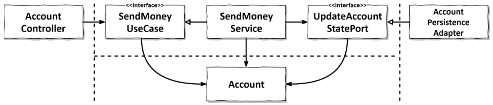
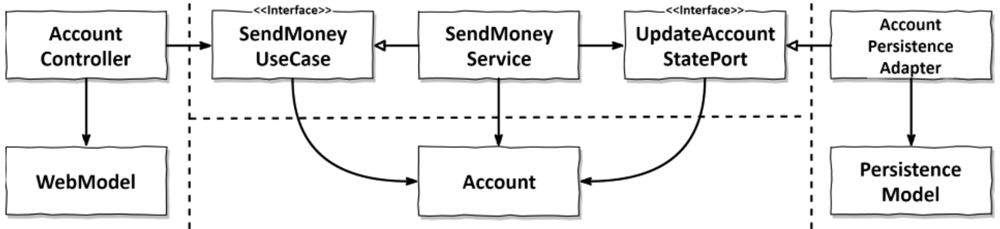
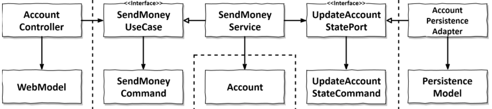
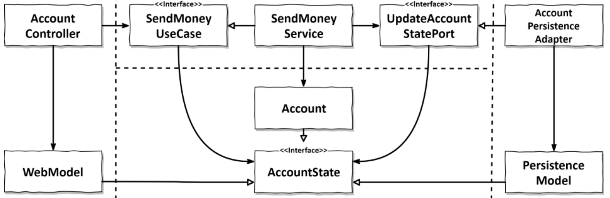

# Mapping between boundaries

We have seen the role of the 4 different layers (web, application, domain and persistence) and explained they has different models.

We must then find a way to map the models in order to communicte between layers.

People might be tempted to share models between layers to avoid having multiple times a similar model, and plenty of boilerplate code.

We must keep in mind that sharing models also couples the layers, which we want to avoid.

This chapter covers different mapping strategies.

## The "no mapping" strategy

As you can see, if everything uses the domain model, we don't need mapping.

### Positive

It's the fastest strategy.

For a simple CRUD, where everything needs the very same model, this is fine.

If this simple CRUD gets more complex with time, we can still migrate to a more complex mapping strategy.

### Negative

The problem with this is that if any of the layers need some specific changes on the entity, like some annotations for an ORM or json conversion, all of this is in one place.

This violates the Single Responsibility Principle, as we have more than one reason to change the domain entity.

## The "two-way" mapping strategy

This strategy gives their own models to the web and persistence layer.

They are responsible for mapping their model to they domain model (taken as input by the application core) and from the domain model (given as output by the application core).

### Positive

Each layer can have its own model, and changes in this model will not trigger changes in the other layers.

Easy to understand and apply.

It satisfies the Single Responsibility Principle.

No mapping logic within the application core.

### Negative

Lots of code to make it work.

May be used as a standard even for CRUD use cases, which would uselessly slow down development.

## The "full" mapping strategy

This strategy is the same as the two-way mapping, with an added model for each operation.

Here, they are named "Command".

### Positive

This strategy leaves no room for error.

We don't have to guess which fields matter for the operation we're trying to do, as they're explicitly required in the model.

It's also easier to implement than the two-way mapping, as we don't have to create models that work for every operations, just for the one we're currently doing.

### Negative

It requires even more boilerplate code than two-way mapping.

It's good for interactions between the web and application layers, but a bit useless for application t persistence layer (which tend to share similar models).

Sometimes it's also better to use this strategy for input models, and then use the domain model as output.

In the end, why not mix mapping strategies according to the needs of each operation and each use case.

## The "one-way" mapping strategy.

Here, `AccountState` is an interface common to all models of all layers.

### Positive

We don't have to map before sending to other layers, as we send something that implements the common interface.

In the application core, the implementation might be rich to allow business logic.

Outer layers may use the interface directly, or implement their own version of it. They can't modify it as the interface doesn't allow it.

In the application core, we use what is called a "factory" in DDD.

In this context, a factory is something that builds a domain object from a state: we take an object that implements the state interface, and turn it into our implementation of it in the rich domain layer.

The point of this strategy is that we map only once (or not at all): when we receive the object in each layer.

Better if we have similar models between layers (which might allow us to use the interface directly in the web layer, avoiding us some mappings).

### Negative

More complex than the others.

Conceptually harder to grasp.

## When to use which mapping strategy

The key point is to make sure we adapt our strategy to each situation.

For this to stay consistent, it is a good idea to describe exactly which situation calls for which strategy in our project.

These guidelines must be created as a team, and can be modfified to fit the needs of the team.

### Example mapping strategy guidelines

#### Modifying use case

web <-> application: full mapping

application <-> persistence: no mapping OR two way mapping if specific persistence issues

#### Query

All layers: no mapping OR two way mapping if web layer trespassing on application layer

## How does this help me build maintainable software?

Having ports allows us to have consistent mapping strategies.

We must choose the right strategy for each situation.

This choice must follow guidelines agreed upon by the complete team.
