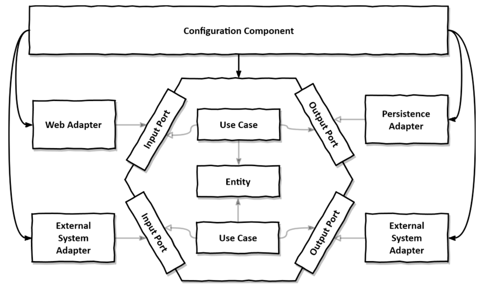

# Assembling the application

This chapter will discuss the different ways to use dependency injection to assemble our layers in plain Java, and with Spring and Spring Boot.

## Why even care about assembly?

What we are trying to do here is make sure the dependencies are towards the application layer, and the application layer doesn't depend on any class.

We therefore need a neutral component to instanciate all our classes, injecting their dependencies.

This component will depend on **all** classes of our application.

Here is what this looks like:



This configuration component has all these responsibilities:
- take external config into account
- create web adapter instances,
- ensure that HTTP requests are actually routed to the web adapters,
- create use case instances,
- provide web adapters with use case instances
- create persistence adapter instances,
- provide use cases with persistence adapter instances,
- and ensure that the persistence adapters can actually access the database.

## Assembling via plain code

```java
package copyeditor.configuration;
class Application {
    public static void main(String[] args) {
        AccountRepository accountRepository = new AccountRepository();
        ActivityRepository activityRepository = new ActivityRepository();
        AccountPersistenceAdapter accountPersistenceAdapter = new AccountPersistenceAdapter(
            accountRepository,
            activityRepository
        );

        SendMoneyUseCase sendMoneyUseCase = new SendMoneyUseService(
            accountPersistenceAdapter, // LoadAccountPort
            accountPersistenceAdapter  // UpdateAccountStatePort
        );
        SendMoneyController sendMoneyController = new SendMoneyController(sendMoneyUseCase); 
        
        startProcessingWebRequests(sendMoneyController);
    }
}
```

This approach is not great for a couple reasons:
- all classes must be public to be used by this controller as it is outside their package
- as we add more things in our app this class will grow huge

There are frameworks like Spring that solve these problems.

## Assembling via Spring's classpath scanning

### Using annotations

```java
@Component
@RequiredArgsConstructor
class AccountPersistenceAdapter implements LoadAccountPort, UpdateAccountStatePort {
    private final AccountRepository accountRepository;
    private final ActivityRepository activityRepository;
    private final AccountMapper accountMapper;

    @Override
    public Account loadAccount(AccountId accountId, LocalDateTime baselineDate) { 
        ...
    }

    @Override
    public void updateActivities(Account account) { 
        ...
    }
}
```

Here, `@RequiredArgsConstructor` uses Lombok to generates a constructor that takes all its final fields as arguments.

@Component makes this class a component, and everytime a class has an injected dependency of this class, Spring will scan for @Component annotated classes, find this one and inject it.

### Creating a custom annotation

```java
@Target({
    ElementType.TYPE
})
@Retention(RetentionPolicy.RUNTIME)
@Documented
@Component
public @interface PersistenceAdapter {
    @AliasFor(annotation = Component.class)
    String value() default "";
}
```

### Not the best approach

This makes our classes framework-dependent, because we have Spring annotations.

It also uses class scanning, which is kind of magic.

This could produce magic bugs that would be very hard to fix.

## Assembling via Spring's Java config

This approach consists of having configuration files that instanciate a part of the app.

Here is an example of one that instanciates persistence adapters:

```java
@Configuration
@EnableJpaRepositories
class PersistenceAdapterConfiguration {
    @Bean
    AccountPersistenceAdapter accountPersistenceAdapter(
        AccountRepository accountRepository,
        ActivityRepository activityRepository,
        AccountMapper accountMapper) {
            return new AccountPersistenceAdapter(
                accountRepository,
                activityRepository,
                accountMapper);
    }

    @Bean
    AccountMapper accountMapper() {
        return new AccountMapper();
    }
}
```

Here, classpath scanning is ok because we don't scan everything, but just the config classes.

As you can see, we create "Beans", with the little factories we annotate with `@Bean`.

The `@EnableJpaRepositories` provides the repositories to the factories here.

The only drawback of this approach is that we must put the config classes in the scope of the classes, but then we have some class visibility issues.

## How does this help me build maintainable software?

The features seen here make our life easier.

The separation in Beans makes it modular, and therefore easier to maintain and easier to test.
